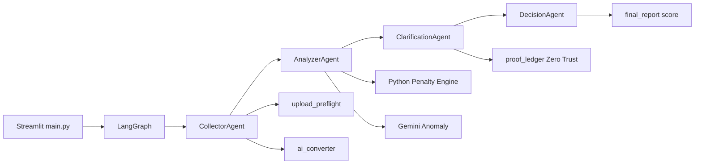

# İadeAjan

**Yapay Zeka Destekli Zero Trust KDV İade Denetim Motoru**

İadeAjan; ihracat ve tevkifat KDV iadelerinde Excel fatura listelerini, kanıt belgelerini (GÇB, YMM, e-Fatura) ve mevzuat kurallarını tek bir **otonom denetim hattında** birleştirir. Çıktı: 0–100 güven skoru, finansman uygunluğu, satır/sütun düzeyinde veri uyarıları ve «hedef skora ulaşmak için» iyileştirme planı.

> **BTK Akademi jürisi:** Bu depo, jürinin kendi bilgisayarında `git clone` → sanal ortam → `.env` → `streamlit run main.py` ile çalıştırılması için hazırlanmıştır. Gerçek API anahtarları repoda **yoktur**.

---

## Öne çıkanlar

| Özellik | Açıklama |
|--------|----------|
| **LangGraph orkestrasyonu** | Collector → Analyzer → Clarification → Decision döngüsü |
| **Python kural motoru** | `PENALTY_MATRIX` ile deterministik ceza ve finansman kilidi |
| **Zero Trust kanıt defteri** | PDF/GÇB yüklemeleri; doğrulanmamış envanter «mevcut» sayılmaz |
| **Büyük Excel** | 50.000 satıra kadar; 10.000+ satırda bellek dostu `read_only` okuma |
| **Hücre düzeyi preflight** | Satır, sütun harfi ve Türkçe hata mesajı; CSV dışa aktarım |
| **Streamlit arayüzü** | Landing → giriş → analiz merkezi; nihai rapor ve skor iyileştirme planı |

---

## Mimari



### LangGraph otonom ajanları

1. **CollectorAgent** — Excel/CSV/JSON yükler; tabular veriyi kanonik fatura/tedarikçi paketine çevirir; belge envanterini oluşturur.
2. **AnalyzerAgent** — Önce Python mevzuat kuralları; isteğe bağlı Gemini anomali katmanı; makro bütünlük (dosya anlamsızsa LLM atlanır).
3. **ClarificationAgent** — Eksik belge / belirsiz iade türü için sorular; kanıt yükleme ve ledger doğrulaması.
4. **DecisionAgent** — Nihai skor, risk bandı, finansman uygunluğu, `remediation_plan` (yapılacaklar listesi).

### Python kural motoru

Ceza kodları ve puanlar `app/schemas/penalty_codes.py` içinde merkezîdir. Analyzer, LLM başarısız olsa bile aynı matrise göre **fallback** üretir; çift ceza engellenir.

### Zero Trust kanıt defteri

`proof_ledger` kayıtları `source=verified` olmadan kritik belgeler (ör. GÇB) envanterde «mevcut» kabul edilmez. `STRICT_INVENTORY_TRUST` ve `REQUIRE_VERIFIED_PROOF` ile sıkı mod (varsayılan: açık).

---

## Test kapsamı

Otomatik test paketi jüri makinesinde **API anahtarı olmadan** çalışacak şekilde yapılandırılmıştır (mock / stub modları).

| Metrik | Değer |
|--------|--------|
| Toplam test | **82** |
| Geçen | **81** |
| Atlanan | **1** (opsiyonel entegrasyon) |
| Süre (referans) | ~60 sn |

Kapsam özeti:

| Alan | Dosya / marker |
|------|----------------|
| E2E doğrulama akışı | `tests/test_e2e_verification_flow.py` |
| Güvenlik saldırı senaryoları | `tests/test_security_attack_suite.py` |
| UI yolculuğu (Streamlit AppTest) | `tests/test_ui_user_journey.py` (`-m ui`) |
| Excel / büyük dosya + skor | `tests/test_large_excel.py` |
| Kanıt defteri, çapraz doğrulama | `tests/test_proof_ledger.py`, `tests/test_verification_cross_validate.py` |
| Skor iyileştirme planı | `tests/test_remediation_plan.py` |

```bash
# Tüm birim + E2E testleri (önerilen)
PYTHONPATH=. pytest -q

# Yalnızca hızlı paket (yavaş / UI hariç)
PYTHONPATH=. pytest -q -m "not slow and not ui"

# Streamlit UI smoke
PYTHONPATH=. pytest tests/test_ui_user_journey.py -m ui -q
```

---

## Jüri / inceleyen — sizin yapmanız gerekenler

Repoyu klonlayan kişinin (BTK jürisi, hakem, teknik inceleyici) kendi bilgisayarında **sırayla** yapması gerekenler:

| # | Görev | Zorunlu mu? |
|---|--------|-------------|
| 1 | **Python 3.11+** ve **git** kurulu olsun | Evet |
| 2 | Depoyu klonlayın; proje köküne girin | Evet |
| 3 | Sanal ortam oluşturup aktive edin (`.venv`) | Evet |
| 4 | `pip install -r requirements.txt` | Evet |
| 5 | `cp .env.example .env` — **kendi** `.env` dosyanızı oluşturun | Evet |
| 6 | `.env` içine **kendi** `GOOGLE_API_KEY` değerinizi yazın **veya** aşağıdaki demo modunu kullanın | En az biri |
| 7 | `streamlit run main.py` → tarayıcıda **http://localhost:8501** | Evet |
| 8 | Landing → **Analiz Merkezine Git** → giriş ekranı (demo; gerçek kullanıcı kaydı yok) | Uygulama akışı |
| 9 | Sidebar’dan demo senaryo **veya** örnek Excel yükleyip **Analizi Başlat** | Değerlendirme |
| 10 | İhracat akışında GÇB sorusuna **PDF kanıt** yükleyip **Cevapları Gönder** | Tam senaryo için |
| 11 | Nihai raporda skor, finansman paneli ve «Hedef Skora Ulaşmak İçin Yapılacaklar» bölümünü kontrol edin | Değerlendirme |
| 12 | (İsteğe bağlı) `pip install -r requirements-dev.txt` → `PYTHONPATH=. pytest -q` | Test doğrulama |

**Sizin yapmanız gerekmeyenler**

- Repodaki `.env.example` dosyasını gerçek anahtarla doldurup commit etmeyin.
- `.env`, `logs/`, `.venv/` klasörlerini GitHub’a yüklemeyin (zaten `.gitignore` içinde).
- GİB / gümrük **canlı** API bağlantısı kurmanız gerekmez; varsayılan `stub` yeterlidir.

**API anahtarı olmadan hızlı demo**

`.env` dosyanızda şunları kullanabilirsiniz (LLM kapalı, mock mod):

```env
LLM_ANOMALY_ENABLED=false
MOCK_DOCUMENT_EXTRACTION=true
GIB_VERIFICATION_MODE=stub
ALLOW_MOCK_FALLBACK=true
```

Ardından uygulamada sidebar’dan hazır **demo senaryo** seçerek tam akışı API maliyeti olmadan izleyebilirsiniz.

**Excel ile deneme**

- Arayüzde **Örnek şablon Excel indir** veya `assets/templates/iadeajan_fatura_sablonu.xlsx`
- Sütun rehberi: [docs/KULLANICI_YUKLEME_REHBERI.md](docs/KULLANICI_YUKLEME_REHBERI.md)
- Büyük dosya üst sınırı: 50.000 satır (`MAX_UPLOAD_ROWS`)

**Sorun giderme**

| Belirti | Olası çözüm |
|---------|-------------|
| `ModuleNotFoundError` | Sanal ortam aktif mi? `pip install -r requirements.txt` tekrar |
| `GOOGLE_API_KEY eksik` | `.env` oluşturun veya `LLM_ANOMALY_ENABLED=false` |
| Port meşgul | `streamlit run main.py --server.port 8502` |
| macOS / Windows yolu | Komutları proje kökünde (`main.py` olan dizin) çalıştırın |

---

## Kurulum (komutlar)

### Ön koşullar

- **Python 3.11+** (3.13 ile doğrulanmıştır)
- **git**
- İsteğe bağlı: [Google AI Studio](https://aistudio.google.com/apikey) API anahtarı (LLM ve belge sınıflandırma için; olmadan da kısıtlı mod çalışır)

### Adımlar

```bash
# 1 — Depoyu klonlayın (URL'yi kendi GitHub organizasyonunuzla değiştirin)
git clone https://github.com/polatsakarya35/BTK-Hackathon-IadeAjan.git
cd BTK-Hackathon-IadeAjan

# 2 — Sanal ortam
python3 -m venv .venv
source .venv/bin/activate          # Windows: .venv\Scripts\activate

# 3 — Bağımlılıklar
pip install -r requirements.txt
# Testleri çalıştıracaksanız:
pip install -r requirements-dev.txt

# 4 — Ortam dosyası (GERÇEK anahtarı yalnızca .env içine yazın)
cp .env.example .env
# .env dosyasını düzenleyin: GOOGLE_API_KEY=...

# 5 — Uygulamayı başlatın
streamlit run main.py
```

Tarayıcıda varsayılan adres: **http://localhost:8501**

### Demo modu (API anahtarı olmadan)

`.env` içinde örnek:

```env
LLM_ANOMALY_ENABLED=false
MOCK_DOCUMENT_EXTRACTION=true
GIB_VERIFICATION_MODE=stub
ALLOW_MOCK_FALLBACK=true
```

Sidebar’dan demo senaryo seçilebilir veya şablon Excel yüklenerek akış test edilir.

---

## Proje yapısı

```
iadeajan/
├── main.py                 # Streamlit giriş noktası
├── app/
│   ├── agents/             # LangGraph düğümleri
│   ├── graph/workflow.py   # Durum makinesi
│   ├── schemas/            # Ceza kodları, UploadIssue
│   └── services/           # Yükleme, preflight, kanıt, GİB stub
├── tests/                  # pytest paketi
├── docs/                   # Teknik rehberler (TR)
├── assets/templates/       # Örnek Excel şablonu
├── requirements.txt
├── requirements-dev.txt
└── .env.example            # Şablon — gerçek sırlar YOK
```

---

## Ortam değişkenleri

Tüm değişkenler ve açıklamaları [`.env.example`](.env.example) dosyasında listelenmiştir.

| Değişken | Jüri için öneri |
|----------|------------------|
| `GOOGLE_API_KEY` | Kendi anahtarınız (opsiyonel) |
| `ENABLE_REAL_GIB_API` | `false` |
| `GIB_VERIFICATION_MODE` | `stub` |
| `ALLOW_MOCK_FALLBACK` | `true` (demo) |

---

## Ek dokümantasyon

| Belge | İçerik |
|-------|--------|
| [docs/KULLANICI_YUKLEME_REHBERI.md](docs/KULLANICI_YUKLEME_REHBERI.md) | Excel sütunları, satır/sütun hata raporu |
| [docs/UYGULAMA_CALISMA_MANTIGI_ve_GUVENLIK.md](docs/UYGULAMA_CALISMA_MANTIGI_ve_GUVENLIK.md) | Akış, Zero Trust, env tablosu |
| [docs/PYTHON_VS_LLM_DEDEKTIF_ROLLER.md](docs/PYTHON_VS_LLM_DEDEKTIF_ROLLER.md) | Python vs LLM sorumlulukları |

---

## Güvenlik uyarısı

- `.env` dosyasını **asla** commit etmeyin.
- API anahtarı sızdıysa Google AI Studio’dan **iptal edip yenileyin**.
- Üretimde `ALLOW_MOCK_FALLBACK=false`, `STRICT_INVENTORY_TRUST=true` kullanın.

### Public’e push öncesi (BTK teslim)

1. Gerçek anahtar yalnızca `.env` içinde olsun (`cp .env.example .env`).
2. Doğrulama scriptini çalıştırın:

```bash
chmod +x scripts/verify_public_ready.sh
./scripts/verify_public_ready.sh
```

3. `git status` çıktısında **`.env`**, **`logs/`**, **`.venv/`** görünmemeli.
4. Anahtar daha önce paylaşıldıysa → Google AI Studio’dan **rotate** edin.

---

## Lisans ve iletişim

BTK Akademi proje teslimi kapsamındadır. Sorular için depo **Issues** sekmesi veya ekibinizin iletişim kanalı kullanılabilir.
