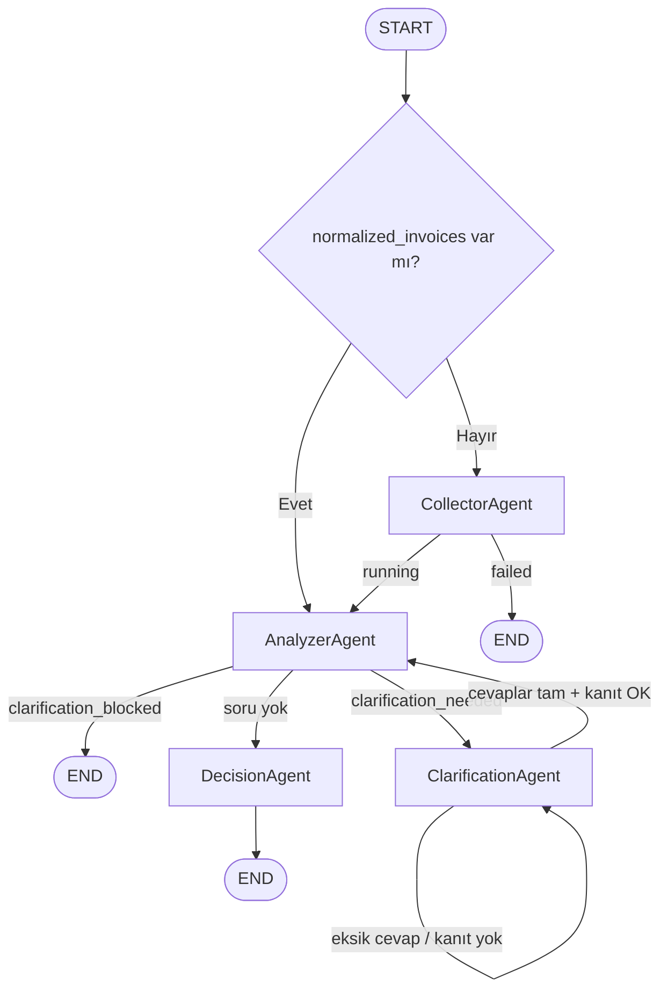

# İadeAjan Ajanları — Ne Yapıyorlar?

Bu belge `app/agents/` altındaki dört LangGraph ajanının görevini, girdilerini/çıktılarını ve birbirleriyle ilişkisini özetler. Orchestrasyon: [`app/graph/workflow.py`](../app/graph/workflow.py). Ortak state: [`app/core/state.py`](../app/core/state.py) → `IadeAjanState`.

---

## Genel akış

| Sıra | Ajan | Tek cümle |
|------|------|-----------|
| 1 | **CollectorAgent** | Dosyayı okur, faturaları/tedarikçileri/belgeleri normalize eder, iade türünü tespit eder. |
| 2 | **AnalyzerAgent** | Mevzuat kuralları + LLM ile risk/eksik belge üretir; gerekirse soru listesi çıkarır. |
| 3 | **ClarificationAgent** | Kullanıcıya soruları iletir; cevapları ve kanıt defterini doğrular; envanteri günceller. |
| 4 | **DecisionAgent** | Skoru hesaplar, risk bandını ve finansman uygunluğunu verir; `final_report` üretir. |

**Döngü:** Clarification cevapları tamamlanınca akış **Decision’a değil**, tekrar **Analyzer**’a döner (bütünsel yeniden tarama). Analyzer artık soru üretmezse **Decision** çalışır.

---

## 1. CollectorAgent

**Dosya:** [`app/agents/collector_agent.py`](../app/agents/collector_agent.py)  
**Node:** `collector_node`  
**Sonraki adım (başarılı):** `AnalyzerAgent` (`current_agent`, `analysis_status="running"`)

### Ne yapar?

Sistemin **veri giriş kapısıdır**. Mock senaryo JSON’u veya kullanıcı yüklemesini (Excel, CSV, JSON, PDF/görsel belge) işleyip LangGraph state’ine analiz edilebilir yapı yazar. **Ceza veya skor üretmez.**

### Ana işlemler

| Fonksiyon | Görev |
|-----------|--------|
| `collector_node` | Giriş noktası: upload mu senaryo mu karar verir |
| `_try_load_upload_payload` | Tabular/JSON → `upload_loader` + `ai_converter.convert_tabular_to_canonical` |
| `_load_scenario_payload` | `scenario_loader.load_scenario` (ör. `celik_as_high`) |
| `_normalize_invoice` / `_normalize_supplier` / `_normalize_document` | Ortak şema alanları |
| `_detect_refund_type` | Faturalardan `ihracat` / `tevkifat` / `belirsiz` |
| `_enrich_company_profile_from_upload` | Boş profilde şirket adı, VKN, tutar, dönem |
| `_merge_llm_documents_into_inventory` | PDF/görsel → `document_verification.ingest_document_file` |
| `_build_collector_output` | State patch’i birleştirir |

### Önemli çıktılar (`IadeAjanState`)

- `normalized_invoices`, `normalized_suppliers`, `document_inventory`
- `company_profile` (içinde `refund_type`, `estimated_refund_amount`, `analysis_period`)
- `classification_result` (`refund_type`, güven seviyesi)
- `date_range`, `company_name`, `tax_number`
- `process_warnings` (belge çıkarımından gelen uyarılar birleşebilir)

### Hata / güvenlik

- Upload başarısız + `ALLOW_MOCK_FALLBACK=false` → `analysis_status="failed"`, graph **END** (Analyzer çalışmaz).
- Upload başarısız + fallback açık → mock senaryoya düşer (`scenario_id`).

### LLM kullanımı (dolaylı)

- Tabular heuristic yetmezse: `ai_converter._llm_convert`
- Yüklenen belgeler: `classify_document` + `extract_document_fields` (verification pipeline içinde)

---

## 2. AnalyzerAgent

**Dosya:** [`app/agents/analyzer_agent.py`](../app/agents/analyzer_agent.py)  
**Node:** `analyzer_node`  
**Sonraki adım:** `ClarificationAgent` **veya** `DecisionAgent` **veya** `END` (blok)

### Ne yapar?

KDV iade dosyasının **risk ve eksik belge analiz motorudur**. İki katmanlıdır:

1. **Python mevzuat katmanı** (her zaman) — belge, süre, dönem, tedarikçi, makro bütünlük.
2. **LLM denetçi** (koşullu) — semantik anomaliler; puanı yine Python matrisi keser.

Ayrıca **clarification sorularını** üretir (`_build_clarification_questions`).

### Python kuralları (`_apply_*`)

| Fonksiyon | Ne kontrol eder | Örnek kod |
|-----------|-----------------|-----------|
| `_apply_export_rules` | İhracat → GÇB (`GCB_MISSING`) | `refund_type == "ihracat"` |
| `_apply_amount_mismatch_rules` | Fatura ↔ GÇB tutar %5+ | `AMOUNT_MISMATCH_GCB` |
| `_apply_tevkifat_rules` | 2 No eksik/ödenmemiş | `NO2_*`, `TEVKIFAT_MISSING_DECL` |
| `_apply_supplier_risk_rules` | SMİYB / kara liste / yüksek risk | `SUPPLIER_*` |
| `_apply_ymm_rules` | Tutar > 50k → YMM | `YMM_REPORT_MISSING` |
| `_apply_deadline_rules` | Zamanaşımı | `DEADLINE_*` |
| `_apply_period_rules` | Dönem dışı fatura | `PERIOD_OUT_OF_RANGE` |
| `_apply_macro_integrity_rules` | Toplam ≤0 veya %75 sıfır/negatif fatura | `DATA_INTEGRITY_FAILURE`, `REFUND_LOGIC_IMPOSSIBLE` |

Ceza kaydı: `add_penalty` / `add_missing_doc_penalty` → `penalty_codes.compute_code_penalty`.

### LLM katmanı

| Fonksiyon | Görev |
|-----------|--------|
| `_detect_anomalies_with_llm` | Gemini structured → `LLMAnalysisResult` |
| `_validate_llm_result` | `LLM_ALLOWED_CODES` filtresi, `add_penalty` |
| `_build_llm_system_prompt` | İade türüne göre odak kodlar |

**LLM kapalı / başarısız:** `_apply_data_quality_rules_fallback` → `DQ_INVALID_DATE`, `DQ_ZERO_AMOUNT`, `DQ_INVALID_VKN`.

**Makro kilit:** `_apply_macro_integrity_rules` `True` dönerse LLM ve fallback **atlanır** (`macro_skip_llm`).

### Clarification üretimi

- Eksik GÇB → `q_gumruk_001` (`has_customs_declarations`)
- Eksik 2 No → `q_2no_001` (`has_2no_declaration`)
- En fazla 3 soru; **`q_refund_type_001` artık üretilmez** (iade türü yalnızca Collector)

### Önemli çıktılar

- `risk_items` — yapılandırılmış risk listesi (`code`, `score_impact`, `source`)
- `missing_docs` — eksik belge cezaları
- `process_warnings` — uyarı metinleri (ceza değil)
- `risk_analysis` — özet (`llm_used`, `llm_summary`, sayılar)
- `score_inputs` — Decision için girdi
- `clarification_needed`, `clarification_questions`
- `retry_count` — her Analyzer turunda +1

### Blokaj: `clarification_blocked`

`clarification_needed` ve `retry_count >= max_retries` (varsayılan 5) → `analysis_status="clarification_blocked"`, graph **END**, **Decision çalışmaz**, skor üretilmez.

---

## 3. ClarificationAgent

**Dosya:** [`app/agents/clarification_agent.py`](../app/agents/clarification_agent.py)  
**Node:** `clarification_node`  
**Sonraki adım (cevaplar tam):** `AnalyzerAgent` (`NEXT_AGENT`)

### Ne yapar?

**İnsan–sistem köprüsüdür.** Analyzer’ın ürettiği soruları kullanıcıya sunar (Streamlit `main.py` ile), cevapları işler ve **Zero Trust kanıt** kontrolünden geçirir. Kendi başına ceza hesaplamaz; envanteri güncelleyip Analyzer’a geri gönderir.

### İki mod

| Mod | Koşul | Davranış |
|-----|--------|----------|
| **Üretim** (`_production_mode`) | `clarification_answers` boş / eksik soru | `clarification_message` üretir (LLM veya statik fallback); `analysis_status="clarification_waiting"` |
| **İşleme** (`_processing_mode`) | Tüm zorunlu sorular cevaplı | Kanıt doğrula → envanter merge → `clarification_needed=False` → Analyzer |

### Kritik fonksiyonlar

| Fonksiyon | Görev |
|-----------|--------|
| `_generate_clarification_message` | Gemini ile kurumsal metin (opsiyonel) |
| `validate_clarification_answers` | `proof_ledger` — belge sorularında `passed` kanıt şart |
| `merge_inventory_from_questions` | `REQUIRE_VERIFIED_PROOF=true` ise yalnızca doğrulanmış kanıt → envanter |
| `_refund_type_cross_check` | Eski `refund_type` cevabı uyumsuzluğu uyarısı (soru artık yok) |
| `purge_expired` | Süresi dolan kanıt kayıtlarını temizler |

### Belge kanıtı alanları

`clarification_proof.PROOF_DOCUMENT_FIELDS`:

- `has_customs_declarations` → GÇB
- `has_2no_declaration` → 2 No’lu KDV
- `has_ymm_contract` → YMM

“Evet” demek tek başına yetmez; `ingest_document_file` + `cross_validate` ile `proof_ledger`’da `verification_status=="passed"` gerekir.

### Önemli çıktılar

- `clarification_message` — UI’da gösterilen metin
- `clarification_needed` — true: bekle; false: Analyzer’a dön
- `document_inventory` — kanıtlı merge sonrası güncel envanter
- `analysis_status` — `clarification_waiting` veya `running`
- `process_warnings` — kanıt hataları metin olarak eklenebilir

---

## 4. DecisionAgent

**Dosya:** [`app/agents/decision_agent.py`](../app/agents/decision_agent.py)  
**Node:** `decision_node`  
**Sonraki adım:** `END` (graph sonu)

### Ne yapar?

Analiz turunun **nihai hakimidir**. `risk_items` ve `missing_docs` üzerinden skoru toplar, risk kategorisini ve ön onay metnini belirler, **faktoring/ön finansman uygunluğunu** hesaplar. `final_report` objesini üretir — UI bunu gösterir.

**LLM çağırmaz** (yalnızca Analyzer’dan gelen `llm_summary` rapora yazılır).

### Ana adımlar (`decision_node`)

1. `failed` / `clarification_blocked` → `_minimal_blocked_report` (skor yok veya kısıtlı özet).
2. `total_risk_penalty` = Σ|risk `score_impact`|; `doc_penalty` = Σ|missing_docs|.
3. `_compute_clarification_bonus` — GÇB/2No “Evet” (+6/+3); kanıt `passed` ise pending sayılmaz.
4. `calculated_score` = clamp(100 − toplam kesinti + bonus, 0, 100).
5. `_determine_risk_category` — ≥90 Düşük, ≥60 Orta, altı Yüksek.
6. `pending_verifications` varsa ve onay “approved” ise → `conditional_approval`.
7. `_check_finance_eligibility` — Düşük risk + tutar ≥ 50.000 + `MANDATORY_LOCK_CODES` yok.
8. `final_report` + `analysis_status="completed"`.

### Finansman kilidi

`MANDATORY_LOCK_CODES` (`penalty_codes.py` — `is_mandatory_lock=True`):

- `GCB_MISSING`, `NO2_DECLARATION_MISSING`, `YMM_REPORT_MISSING`
- `SUPPLIER_BLACKLIST_LOCK`
- `DATA_INTEGRITY_FAILURE`, `REFUND_LOGIC_IMPOSSIBLE`

Skor yüksek olsa bile kilit varsa → `finance_eligibility.eligible=False` ve `finance_headline` (Ön Onay: RED …).

### Önemli çıktılar

- `final_report` — skor, kategori, ceza dökümü, finansman, `mandatory_lock_triggered`, `llm_summary`
- `analysis_status` — `"completed"`
- `verification_summary` — disclaimer vb.

---

## Ortak yardımcılar (ajanlar arası)

| Bileşen | Konum | Rol |
|---------|-------|-----|
| `add_penalty` / `add_missing_doc_penalty` | `analyzer_agent.py` | Tek ceza yazım noktası (Analyzer) |
| `compute_code_penalty` | `penalty_codes.py` | Puan matrisi |
| `proof_ledger` | `app/services/proof_ledger.py` | Clarification kanıt defteri |
| `document_verification.ingest_document_file` | Collector + UI upload | Belge doğrulama |
| `inventory_trust_policy` | Zero Trust envanter sayımı | Analyzer GÇB kuralları |

---

## Streamlit (`main.py`) ile ilişki

UI graph’ı doğrudan çalıştırmaz; faz makinesi ile aynı node’ları tetikler:

| UI fazı | Ajan(lar) |
|---------|-----------|
| `running` (segment 1) | Collector → Analyzer → (Clarification bekler) |
| `clarification` | Kullanıcı cevap + kanıt → Clarification → Analyzer → … |
| `done` | Decision sonrası `final_report` |
| `blocked` | `clarification_blocked` veya `failed` |

Clarification sonrası ikinci turda `normalized_invoices` dolu olduğu için `route_from_start` Collector’ı **atlar**, doğrudan Analyzer çalışır.

---

## Hızlı karar tablosu

| Soru | Cevap |
|------|--------|
| Skoru kim hesaplar? | **DecisionAgent** (toplama); ceza puanını kim yazar? **AnalyzerAgent** (`add_penalty`). |
| İade türünü kim seçer? | **CollectorAgent** (`_detect_refund_type`); kullanıcı radyosu yok. |
| LLM nerede? | Analyzer (anomali), Collector/Clarification (belge/mesaj, dolaylı). |
| Belgeler ne zaman “mevcut” sayılır? | `source=verified` + `verification_status=passed` (veya senaryo). |
| Ne zaman skor çıkmaz? | `failed`, `clarification_blocked`. |

---

## İlgili dokümanlar

- [`docs/ANOMALI_HARITASI_VE_YONETIMI.md`](ANOMALI_HARITASI_VE_YONETIMI.md) — anomali türleri ve koruma
- [`docs/PYTHON_VS_LLM_DEDEKTIF_ROLLER.md`](PYTHON_VS_LLM_DEDEKTIF_ROLLER.md) — Python vs LLM dedektif ayrımı
- [`docs/UYGULAMA_CALISMA_MANTIGI_ve_GUVENLIK.md`](UYGULAMA_CALISMA_MANTIGI_ve_GUVENLIK.md) — uçtan uca güvenlik
- [`docs/IADEAJAN_ALGORITMA_v3.2.md`](IADEAJAN_ALGORITMA_v3.2.md) — skor ve kanunname

---

*Son güncelleme: `app/agents` ve `workflow.py` mevcut haliyle uyumludur.*
