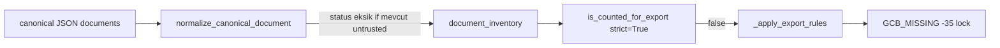
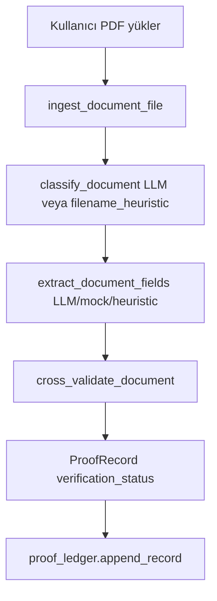
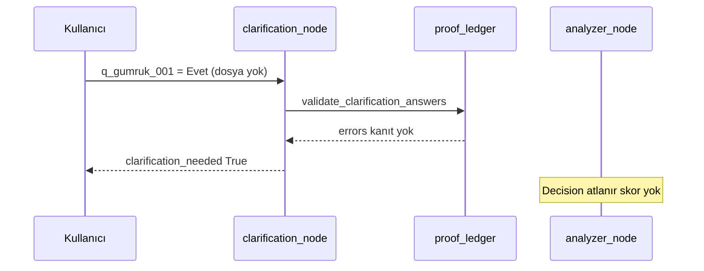

# Anomali Haritası ve Yönetimi — Teknik Başvuru Kılavuzu

> **Amaç:** İadeAjan sisteminde hangi anomalinin nasıl tespit edildiği, nasıl cezalandırıldığı ve Zero Trust ile hangi bypass yollarının kapandığının uçtan uca, kod referanslı açıklaması.  
> **İlgili kaynak kod:** `app/agents/analyzer_agent.py`, `app/schemas/penalty_codes.py`, `app/services/verification/cross_validate.py`, `app/services/proof_ledger.py`, `app/services/verification/inventory_trust_policy.py`, `app/agents/decision_agent.py`, `app/agents/collector_agent.py`, `app/services/verification/document_verification.py`.  
> **Tamamlayıcı:** [`docs/PYTHON_VS_LLM_DEDEKTIF_ROLLER.md`](PYTHON_VS_LLM_DEDEKTIF_ROLLER.md) (dedektif/hakim rol ayrımı).  
> **Matrix sürümü:** `v3.2-macro` (`decision_agent.MATRIX_VERSION`).

---

## Önsöz: Uçtan uca akış

```text
[Yükleme]
  upload_loader.load_uploaded_file
    → tabular: ai_converter.convert_tabular_to_canonical (heuristic → _llm_convert)
    → canonical JSON: _normalize_canonical → normalize_canonical_document (Zero Trust)
    → belge: document_verification.ingest_document_file
[CollectorAgent]
  collector_node → _normalize_invoice / _detect_refund_type → document_inventory
[AnalyzerAgent]  analyzer_node
  Katman 1 Python: _apply_export_rules | _apply_tevkifat_rules | _apply_supplier_* | ...
  Makro: _apply_macro_integrity_rules → macro_skip_llm?
  Katman 2: _detect_anomalies_with_llm → _validate_llm_result → add_penalty
  veya: _apply_data_quality_rules_fallback
[ClarificationAgent]  clarification_node
  validate_clarification_answers (proof_ledger)
  merge_inventory_from_questions (REQUIRE_VERIFIED_PROOF)
[AnalyzerAgent]  (döngü — yeniden tarama)
[DecisionAgent]  decision_node
  compute_code_penalty toplamı → skor → _check_finance_eligibility (MANDATORY_LOCK_CODES)
```

**Temel ilke (Path B):** Tespit “dedektif” katmanında (Python kuralı veya LLM structured output); puan kesimi **her zaman** `penalty_codes.compute_code_penalty` üzerinden Python’dadır (`analyzer_agent.add_penalty`, `add_missing_doc_penalty`).

---

## 1. Anomali kategorileri ve tespit motorları

### A) Yapısal ve veri kalitesi anomalileri (DQ)

**Tanım:** Excel/JSON’dan gelen faturalarda yapısal bozukluk — tarih parse edilemiyor, tutar sıfır/negatif, VKN sayısal değil.

| `PenaltyCode` | Matris `source` | Birim / tavan | Normal dedektif | Fallback dedektif |
|---------------|-----------------|---------------|-----------------|-------------------|
| `DQ_INVALID_DATE` | `llm` | 5 / 15 | LLM | Python |
| `DQ_ZERO_AMOUNT` | `llm` | 5 / 10 | LLM | Python |
| `DQ_INVALID_VKN` | `llm` | 3 / 9 | LLM | Python |

#### Normal yol (LLM dedektif)

1. `analyzer_node` makro sonrası `macro_skip_llm == False` ise `_detect_anomalies_with_llm` çağrılır (`analyzer_agent.py`).
2. Kapılar: `LLM_ANOMALY_ENABLED=true`, `GOOGLE_API_KEY` veya `GEMINI_API_KEY`, `google-genai` paketi yüklü.
3. Girdi: `_sanitize_for_llm(normalized_invoices)` — VKN maskeli; en fazla 30 fatura, 15 tedarikçi; payload ~5000 karakter sınırı.
4. Model: `GEMINI_MODEL` (varsayılan `gemini-2.5-flash`), structured JSON → `LLMAnalysisResult` (`app/schemas/models.py` → `PenaltyDetection`).
5. Prompt: `_build_llm_system_prompt(refund_type)` — yalnızca `LLM_ALLOWED_CODES` listelenir; `PYTHON_ONLY_CODES` raporlanmaz.
6. Hakim (Python): `_validate_llm_result`:
   - `code not in LLM_ALLOWED_CODES` → atla, log `[LLM Filtre]`.
   - `count` → `max(1, min(count, 100))` (halüsinasyon tavanı).
   - Aynı kod birleştirilir; `add_penalty(..., source="llm")` → `compute_code_penalty(code, count)`.

**Örnek ceza hesabı:** 5 bozuk tarih → `DQ_INVALID_DATE`, count=5 → ham 25, tavan **15** → `score_impact = -15`.

#### Fallback yol (Python dedektif — LLM devralır)

**Koşul:** `llm_used == False` ve `macro_skip_llm == False` → `analyzer_node` satır 1171–1176:

```python
_apply_data_quality_rules_fallback(
    normalized_invoices, risk_items, process_warnings, seen_risk_keys
)
```

| Kod | Fonksiyon içi mantık | `add_penalty` `source` |
|-----|---------------------|------------------------|
| `DQ_INVALID_DATE` | `_is_valid_date(inv["date"])` false; `date` dolu faturalar | `"fallback"` |
| `DQ_ZERO_AMOUNT` | `(inv.get("amount") or 0) <= 0` | `"fallback"` |
| `DQ_INVALID_VKN` | `supplier_id` var ve `str(...).replace(".","").isdigit()` false | `"fallback"` |

**Çift ceza engeli:** LLM başarılıysa fallback **çalışmaz** (`if not llm_used` bloğu).

**Makro ile DQ:** `_apply_macro_integrity_rules` `True` dönerse hem LLM hem fallback **atlanır**; makro öncesi üretilmiş `DQ_*` varsa `_purge_risk_codes(..., MACRO_PURGE_CODES)` ile silinir (`MACRO_PURGE_CODES = DQ_ZERO_AMOUNT, DQ_INVALID_DATE`).

#### Koruma özeti (A)

| Tehdit | Koruma |
|--------|--------|
| LLM uydurma kod | `LLM_ALLOWED_CODES` filtresi |
| Aşırı count | count ≤ 100, matris `max_penalty` |
| API yok | Deterministik fallback DQ |
| Makro dosya | LLM kapatılır; makro kodları öncelikli |

---

### B) Mevzuat ve doğrulama anomalileri

**Tanım:** KDV iade mevzuatına göre zorunlu belge, süre, dönem, tevkifat beyanı — **deterministik Python** kuralları; LLM prompt’ta bu kodları üretmesi **yasak** (`_build_llm_system_prompt` → `PYTHON_ONLY_CODES`).

#### B.1 Zorunlu belge eksiklikleri

| Kod | Fonksiyon | Tetik koşulu (özet) | Puan | `is_mandatory_lock` |
|-----|-----------|---------------------|------|---------------------|
| `GCB_MISSING` | `_apply_export_rules` | `refund_type=="ihracat"`; envanterde `gumruk_beyannamesi` eksik **veya** doğrulanmış GÇB yok + **güçlü ihracat** (`_invoice_zero_kdv_export`) | 35 | **Evet** |
| `NO2_DECLARATION_MISSING` | `_apply_tevkifat_rules` | `refund_type=="tevkifat"`; 2 No envanterde yok / `status==eksik` | 35 | **Evet** |
| `NO2_DECLARATION_UNPAID` | `_apply_tevkifat_rules` | 2 No var, `is_paid==False` | 15 | Hayır |
| `YMM_REPORT_MISSING` | `_apply_ymm_rules` | `estimated_refund_amount` ≥ `YMM_MANDATORY_THRESHOLD` (50.000) ve YMM yok | 35 | **Evet** |

**GÇB “güçlü ihracat” (C-01 / F-01 sonrası):**

- `_invoice_labeled_export`: `is_export` veya `type=="ihracat"`.
- `_invoice_zero_kdv_export`: ihracat etiketi + (`kdv_rate==0` veya `kdv_amount==0`).
- Yalnızca **etiket ihracat, KDV sıfır değil** → `process_warnings` (ceza yok); `KDV_RATE_MISMATCH_EXPORT` LLM kanalında kalır.

**Envanter sayımı:** `_inventory_entry_present(doc)` → `inventory_trust_policy.is_counted_for_export(doc, strict=STRICT_INVENTORY_TRUST)`:

- `status in {"mevcut"}` ve (`source=="verified"` veya `verification_status=="passed"` veya `source=="scenario"`).

#### B.2 Tutar eşleşmesi (GÇB ↔ fatura)

| Kod | Fonksiyon | Tetik |
|-----|-----------|-------|
| `AMOUNT_MISMATCH_GCB` | `_apply_amount_mismatch_rules` | İhracat faturası; GÇB tutarı envanter `declaration_no`/`amount` veya fatura `customs_declaration_*`; fark > `AMOUNT_MISMATCH_THRESHOLD` (0.05) |

Matris `source=hybrid`; **uygulamada yalnızca Python** tetikler. LLM’e de listelenir ama Analyzer’da ayrı Python kuralı vardır.

#### B.3 Zamanaşımı ve dönem

| Kod | Fonksiyon | Tetik |
|-----|-----------|-------|
| `DEADLINE_CRITICAL` | `_apply_deadline_rules` | `analysis_period.end` + iade türüne göre son başvuru; `days_remaining < 180` |
| `DEADLINE_WARNING_IO` | `_apply_deadline_rules` | `refund_type=="indirimli_oran"` ve 180 ≤ kalan < 365 |
| `PERIOD_OUT_OF_RANGE` | `_apply_period_rules` | ISO parse edilen fatura tarihi `analysis_period` dışında |

**Not:** `PERIOD_OUT_OF_RANGE` parse edilemeyen tarihler için değil; bozuk tarihler **A grubu** `DQ_INVALID_DATE`’e gider.

#### B.4 Tevkifat alan kontrolü

| Kod | Fonksiyon | Tetik |
|-----|-----------|-------|
| `TEVKIFAT_MISSING_DECL` | `_apply_tevkifat_rules` | `is_tevkifat` ve `has_tevkifat_declaration==False` |

#### B.5 Tedarikçi riski (veri kaynaklı)

| Kod | Fonksiyon | Tetik |
|-----|-----------|-------|
| `SUPPLIER_BLACKLIST_LOCK` | `_apply_supplier_risk_rules` | `risk_level=="kritik"` + `is_blacklisted` |
| `SUPPLIER_SMIYB` | `_apply_supplier_risk_rules` | `risk_level=="kritik"` (kara liste değil) |
| `SUPPLIER_HIGH_RISK` | `_apply_supplier_risk_rules` | `risk_level=="yüksek"` |

Kritik tedarikçi → `force_clarification_supplier=True` (clarification döngüsü zorlanabilir).

#### B.6 İade türü yönlendirmesi (ceza değil, kural seçici)

| Fonksiyon | Dosya | Mantık |
|-----------|-------|--------|
| `_detect_refund_type` | `collector_agent.py` | `export_count` / `tevkifat_count` → `ihracat` / `tevkifat` / `belirsiz` |
| `company_profile["refund_type"]` | Collector çıkışı | Analyzer’da tek kaynak; `q_refund_type_001` yok sayılır |

`belirsiz` veya `indirimli_oran`: `_apply_export_rules` / `_apply_tevkifat_rules` **çalışmaz**; GÇB/2 No otomatik tetiklenmez (ihracat/tevkifat sayımı yoksa).

#### Koruma özeti (B)

| Tehdit | Koruma |
|--------|--------|
| Kullanıcı “ihracat seçerek” GÇB bypass | C-01: radyo kaldırıldı; Collector tespiti |
| Sahte “mevcut” JSON GÇB | `normalize_canonical_document` + `STRICT_INVENTORY_TRUST` (§3) |
| LLM’nin GÇB eksikliğini görmezden gelmesi | `PYTHON_ONLY_CODES`; Python Katman 1 her zaman çalışır |

---

### C) Semantik ve davranışsal anomaliler (kurnazlıklar)

**Tanım:** Fatura seti üzerinde anlam, ilişki ve desen — çoğunlukla **LLM dedektif** (`_detect_anomalies_with_llm`), ardından Python hakim.

| Kod | Matris | LLM odak (`get_refund_focus_codes`) | Dedektif |
|-----|--------|--------------------------------------|----------|
| `DUPLICATE_INVOICE` | llm | Tüm türler (base) | LLM |
| `CHRONOLOGY_ERROR` | llm | base | LLM |
| `SELF_INVOICE` | llm | ihracat/tevkifat focus | LLM |
| `KDV_CALC_ERROR` | llm | tevkifat / indirimli_oran | LLM |
| `KDV_RATE_MISMATCH_EXPORT` | llm | ihracat focus | LLM (+ Python uyarı zayıf ihracat) |
| `FUTURE_DATED_INVOICE` | llm | ihracat focus | LLM |
| `GENERAL_ANOMALY_HIGH` | llm | Kanunname dışı ciddi | LLM |
| `GENERAL_ANOMALY_MEDIUM` | llm | Kanunname dışı hafif | LLM |

#### LLM dedektiflik detayı

**Girdi şeması** (`_sanitize_for_llm`): `id`, `type`, `date`, `amount`, `kdv_amount`, `kdv_rate`, `is_export`, `is_tevkifat`, `supplier_vkn_masked` (ilk 3 + son 2 hane).

**Çıktı şeması** (`PenaltyDetection`):

- `code`: `PenaltyCode` enum
- `evidence`: max 200 karakter Türkçe kanıt
- `invoice_ids`: ilgili faturalar
- `count`: DQ kodlarında zorunlu; birleştirmede toplanır
- `macro_flag`: dosya geneli pattern → Shadow Learning (`shadow_learning.log_risk_items_batch`)

**Prompt kuralları (özet):**

- Makro hikâye: tedarikçi çeşitliliği, kronoloji, fatura no düzeni.
- `REFUND_LOGIC_IMPOSSIBLE`: tekil satır hatası değil, kökten mantık çöküşü (ör. ihracat beyanı + tamamı yurtiçi VKN).
- Kanunname dışı pattern → `GENERAL_ANOMALY_*` + `macro_flag: true`.
- `DATA_INTEGRITY_FAILURE` ve Python tetikli makro: LLM’e “erişemezsin” notu (makro zaten Python’da kesilmiş olabilir).

**Hakim adımı:** `_validate_llm_result` → `add_penalty`; `REFUND_LOGIC_IMPOSSIBLE` için `source="hybrid"`, diğerleri `source="llm"`.

**Özet metin:** `llm_result.summary` → `risk_analysis.llm_summary` → UI “AI Denetçi Yorumu” (ceza değil).

#### Koruma özeti (C)

| Tehdit | Koruma |
|--------|--------|
| LLM hayali kod | `LLM_ALLOWED_CODES` |
| Aşırı puan | `compute_code_penalty` tavan + count cap |
| Kanıtsız genel şüphe | `evidence` zorunlu alan; jüri için log |

---

### D) Makro ve mantıksal çöküş anomalileri

**Tanım:** Dosyanın bütünü KDV iade mantığıyla bağdaşmıyor — **Python öncelikli**; tetiklenince **LLM tamamen kapatılır** (bypass engeli).

| Kod | Fonksiyon | Tetik | Puan | Kilit | LLM |
|-----|-----------|-------|------|-------|-----|
| `REFUND_LOGIC_IMPOSSIBLE` | `_apply_macro_integrity_rules` | `neg_zero/total >= 0.75` ve `refund_type in {ihracat, tevkifat, indirimli_oran}` | 50 | **Evet** | **Atlanır** |
| `DATA_INTEGRITY_FAILURE` | `_apply_macro_integrity_rules` | `sum(amounts) <= 0` (üst kural tetiklenmediyse) | 40 | **Evet** | **Atlanır** |
| `REFUND_LOGIC_IMPOSSIBLE` | `_detect_anomalies_with_llm` | Prompt’taki semantik makro örnekler | 50 | **Evet** | Sadece makro yoksa |

#### `_apply_macro_integrity_rules` akışı

1. Her fatura `amount` float; `neg_zero` = tutarı ≤ 0 olan adet.
2. `ratio = neg_zero / total`.
3. **Dal 1:** `ratio >= 0.75` ve iade türü uygun → `_purge_risk_codes(DQ_ZERO_AMOUNT, DQ_INVALID_DATE)` → `add_penalty(REFUND_LOGIC_IMPOSSIBLE, source="python", metadata macro_flag)` → **`return True`**.
4. **Dal 2:** `total_sum <= 0` → aynı purge → `DATA_INTEGRITY_FAILURE` → **`return True`**.
5. Aksi halde `return False` → LLM veya fallback devam eder.

`analyzer_node`:

```python
if macro_skip_llm:
    llm_summary = "Makro kilit tetiklendi — AI denetimi atlandı."
else:
    llm_risk_items, llm_summary, llm_used = _detect_anomalies_with_llm(...)
if not llm_used:
    if not macro_skip_llm:
        _apply_data_quality_rules_fallback(...)
```

**Bypass engeli:** Makro kilit varken LLM “dosyayı temiz” diyerek DQ/anomali üretemez; skor yalnızca makro + Python Katman 1 belgelerinden oluşur.

#### Koruma özeti (D)

| Tehdit | Koruma |
|--------|--------|
| LLM makroyu gizlemesi | Python sayısal eşik önce |
| DQ + makro çift ceza | `_purge_risk_codes` |
| Yüksek skor + sahte temiz dosya | `MANDATORY_LOCK_CODES` finansman kilidi |

---

## 2. Anomalilerin cezalandırılması ve kilitlenme mantığı

### 2.1 PenaltyCode → PENALTY_MATRIX → puan (deterministik hakim)

**Tek kaynak:** `app/schemas/penalty_codes.py` — `PENALTY_MATRIX`, `compute_code_penalty`.

```python
def compute_code_penalty(code: PenaltyCode, count: int = 1) -> int:
    entry = PENALTY_MATRIX.get(code)
    safe_count = max(1, min(int(count), 100))
    raw = safe_count * entry.per_unit_penalty
    capped = min(raw, entry.max_penalty)
    return -capped  # negatif tam sayı
```

**Kayıt üretimi:**

- Risk: `analyzer_agent.add_penalty` → `RiskItem` + `score_impact`.
- Belge: `add_missing_doc_penalty` → `MissingDoc` + `score_impact` (`missing_docs` listesi).

**Çift kayıt engeli:** `seen_risk_keys` / `seen_doc_names` dedupe.

### 2.2 Nihai skor (`decision_agent.decision_node`)

```text
total_risk_penalty = Σ |risk_items[].score_impact|
doc_penalty        = Σ |missing_docs[].score_impact|
total_deduction    = total_risk_penalty + doc_penalty
raw_score          = BASE_SCORE (100) - total_deduction
calculated_score   = clamp(raw_score + clarification_bonus, 0, 100)
```

**Risk bandı:** `_determine_risk_category` — ≥90 Düşük, ≥60 Orta, altı Yüksek.

**Clarification bonus** (`_compute_clarification_bonus`):

| Alan | Cevap | Bonus | Not |
|------|-------|-------|-----|
| `has_customs_declarations` | Evet | +6 | `pending_verification` — kanıt `passed` değilse listelenir |
| `has_customs_declarations` | Bir kısmı mevcut | +3 | Aynı |
| `has_2no_declaration` | Evet / Bir kısmı | +6 / +3 | Aynı |

Kanıt `proof_ledger`’da `passed` ise pending sayılmaz (`_proof_passed_for_field`).

### 2.3 Finansman kilidi (`_check_finance_eligibility`)

```text
base_eligible = (risk_category == "Düşük Risk") AND (estimated_refund_amount >= FINANCE_MIN_AMOUNT [50_000])
```

**Kilit:** `risk_items` veya `missing_docs` içinde herhangi bir kod `MANDATORY_LOCK_CODES` ise → `eligible=False`, `mandatory_lock_triggered` dolu.

Skor ≥ 90 olsa bile kilit varsa → `finance_headline`: *“Ön Onay: RED — Skor yüksek olmasına rağmen…”*

### 2.4 Tam ceza envanteri: kilit vs yalnızca skor

| `PenaltyCode` | Puan (max) | Finansman kilidi | Tipik dedektif | Kayıt listesi |
|---------------|------------|-----------------|----------------|---------------|
| `GCB_MISSING` | −35 | **Evet** | Python | `missing_docs` |
| `NO2_DECLARATION_MISSING` | −35 | **Evet** | Python | `missing_docs` |
| `YMM_REPORT_MISSING` | −35 | **Evet** | Python | `missing_docs` |
| `SUPPLIER_BLACKLIST_LOCK` | −25 | **Evet** | Python | `risk_items` |
| `DATA_INTEGRITY_FAILURE` | −40 | **Evet** | Python | `risk_items` |
| `REFUND_LOGIC_IMPOSSIBLE` | −50 | **Evet** | Python / LLM | `risk_items` |
| `NO2_DECLARATION_UNPAID` | −15 | Hayır | Python | `risk_items` |
| `SUPPLIER_SMIYB` | −25 | Hayır | Python | `risk_items` |
| `SUPPLIER_HIGH_RISK` | −10 | Hayır | Python | `risk_items` |
| `AMOUNT_MISMATCH_GCB` | −15 | Hayır | Python | `risk_items` |
| `DEADLINE_CRITICAL` | −3 | Hayır | Python | `risk_items` |
| `DEADLINE_WARNING_IO` | −5 | Hayır | Python | `risk_items` |
| `PERIOD_OUT_OF_RANGE` | −10 | Hayır | Python | `risk_items` |
| `TEVKIFAT_MISSING_DECL` | −5 | Hayır | Python | `risk_items` |
| `DQ_INVALID_DATE` | −15 | Hayır | LLM / fallback | `risk_items` |
| `DQ_ZERO_AMOUNT` | −10 | Hayır | LLM / fallback | `risk_items` |
| `DQ_INVALID_VKN` | −9 | Hayır | LLM / fallback | `risk_items` |
| `KDV_CALC_ERROR` | −15 | Hayır | LLM | `risk_items` |
| `DUPLICATE_INVOICE` | −10 | Hayır | LLM | `risk_items` |
| `CHRONOLOGY_ERROR` | −8 | Hayır | LLM | `risk_items` |
| `KDV_RATE_MISMATCH_EXPORT` | −10 | Hayır | LLM | `risk_items` |
| `SELF_INVOICE` | −25 | Hayır | LLM | `risk_items` |
| `FUTURE_DATED_INVOICE` | −15 | Hayır | LLM | `risk_items` |
| `GENERAL_ANOMALY_HIGH` | −20 | Hayır | LLM | `risk_items` |
| `GENERAL_ANOMALY_MEDIUM` | −10 | Hayır | LLM | `risk_items` |

`MANDATORY_LOCK_CODES` türetimi:

```python
MANDATORY_LOCK_CODES = frozenset(
    code for code, entry in PENALTY_MATRIX.items() if entry.is_mandatory_lock
)
```

**Özel durumlar:**

- `clarification_blocked` (`retry_count >= max_retries`, kanıt tamamlanamadı): `decision_node` → `_minimal_blocked_report` — **skor üretilmez**.
- `analysis_status == failed`: Collector/upload hatası — Analyzer/Decision atlanır veya minimal rapor.

---

## 3. Zero Trust ve bypass korumaları

### 3.1 Tehdit modeli → kod karşılığı

| Saldırı / bypass girişimi | Beklenen blok | Kod mekanizması |
|--------------------------|---------------|-----------------|
| JSON’da sahte `"status":"mevcut"` GÇB | GÇB sayılmaz, ceza devam | `normalize_canonical_document` |
| Yanlış VKN’li PDF yükleme | Kanıt `failed`, envantere girmeme | `cross_validate_document` → `OWNERSHIP_VKN_MATCH` |
| “Evet” deyip belge yüklememe | Clarification ilerlemez | `validate_clarification_answers` |
| Dosya adından sahte sınıf | `STRICT_PROOF` ile red | `document_verification` → `HEURISTIC_NOT_ALLOWED` |
| Süresi dolmuş kanıt | Yeniden yükleme | `proof_ledger.purge_expired`, `is_expired` |
| Clarification sonsuz döngü | Skor yok | `retry_count >= max_retries` → `clarification_blocked` |

### 3.2 Şema: Canonical JSON enjeksiyonu



**Kod:** `upload_loader._normalize_canonical` → her belge için `inventory_trust_policy.normalize_canonical_document`:

```python
if status == "mevcut" and source not in TRUSTED_SOURCES:  # verified, scenario
    out["status"] = "eksik"
    out["verification_status"] = "unverified"
```

`TRUSTED_SOURCES = {"verified", "scenario"}`.

**Test:** `tests/test_e2e_verification_flow.py::TestE2EScenario3ZeroTrustCanonical` — `source: user_assertion` → `status=="eksik"` veya `is_counted_for_export(..., strict=True)==False` → `GCB_MISSING` tetiklenir.

### 3.3 Şema: Belge kanıtı ve VKN (sahte evrak)



**VKN uyuşmazlığı** (`cross_validate.py`):

- `expected_type in ("gumruk_beyannamesi", "ymm_tasdik_raporu")` ve `doc_vkn != state.tax_number` → `OWNERSHIP_VKN_MATCH` (**error**) → `status="failed"`.
- `validate_vkn_format` / `validate_vkn_checksum` → format hata veya uyarı.

**GÇB alan eksikliği (ceza değil, uyarı):**

- `GCB_DECLARATION_NO_MISSING`, `GCB_AMOUNT_MISSING` → `process_warnings` (`document_verification` merge).

**GİB mock (Faz 3):** `ENABLE_GIB_MOCK=true` → `verify_with_gib` (`gib_api_mock.py`); red → `GIB_MOCK_REJECT`.

**Heuristic sınıflandırma bypass:**

- `document_verification`: `method == "filename_heuristic"` ve `STRICT_PROOF=true` → `HEURISTIC_NOT_ALLOWED` → envantere **eklenmez**.

### 3.4 Şema: Clarification “Evet” without proof



**Kod:**

- `clarification_proof.is_proof_document_field` → `has_customs_declarations`, `has_2no_declaration`, `has_ymm_contract`.
- `proof_ledger.validate_clarification_answers`: olumlu cevap + `get_by_question` yok / `verification_status != passed` → **error**.
- `REQUIRE_VERIFIED_PROOF=true` (varsayılan): `merge_inventory_from_questions` yalnızca `entry_from_verified_proof` — `entry_from_clarification` (kullanıcı beyanı) **kullanılmaz**.

**Kanıtlı merge:** `entry_from_verified_proof` → `source: verified`, `verification_status: passed`, `proof_file_hash`.

### 3.5 Şema: Envanter güveni → mevzuat cezası

```text
_inventory_entry_present(doc)
  → status != "eksik"
  → is_counted_for_export(doc, strict=STRICT_INVENTORY_TRUST)
       → status == "mevcut"
       → is_verified_inventory_entry: source verified | passed | scenario
```

Kaynaklar **sayılmayan:** `user_assertion`, `clarification`, `llm_classifier` (unverified), düşük güven sınıflandırma.

Collector belge pipeline: `ingest_document_file` → `verification_status=="passed"` ise envanter `source: verified`.

### 3.6 Zaman aşımı “hilesi”

**Tehdit:** Kullanıcı sistem tarihini veya `analysis_period`’u manipüle etmeye çalışır.

**Koruma:**

- Zamanaşımı **sunucu** `datetime.now(timezone.utc)` ile `_apply_deadline_rules` içinde hesaplanır; kullanıcı cevabı ile değişmez.
- `analysis_period` upload/collector profilden gelir; boşsa deadline kuralı atlanır (`period_end_str` yok).
- Belge kanıtı TTL: `ProofRecord.is_expired()`, `purge_expired`, `schedule_file_cleanup` — süresi dolan kanıt clarification’da geçersiz.

### 3.7 Clarification retry kilidi (skor bypass engeli)

`analyzer_node`: `clarification_needed` ve `retry_count >= max_retries` (varsayılan 5):

- `analysis_status_override = "clarification_blocked"`
- `workflow.route_after_analyzer` → **END** (Decision yok)
- `process_warnings`: skor üretilmedi mesajı

Bu, “soru-cevap döngüsünde takılıp skor almadan çıkma” yerine bilinçli **blokaj**dır.

### 3.8 Ortam değişkenleri (Zero Trust anahtarları)

| Değişken | Varsayılan (prod hedef) | Etki |
|----------|-------------------------|------|
| `STRICT_INVENTORY_TRUST` | `true` | Doğrulanmamış `mevcut` belge ihracat/YMM sayılmaz |
| `STRICT_PROOF` | `true` | Heuristic belge sınıfı kanıt sayılmaz |
| `REQUIRE_VERIFIED_PROOF` | `true` | Clarification olumlu cevap → ledger `passed` şart |
| `ALLOW_MOCK_FALLBACK` | `false` (prod) | Upload fail → mock senaryo yok |
| `VERIFICATION_AUDIT_ENABLED` | `true` | `proof_ledger.write_audit_line` |
| `ENABLE_GIB_MOCK` | demo | Resmi doğrulama soketi (mock) |

---

## 4. Kategori → motor özeti (başvuru tablosu)

| Kategori | Ana motor | Hakim | Bypass koruması |
|----------|-----------|-------|-----------------|
| **A — DQ** | `_detect_anomalies_with_llm` / `_apply_data_quality_rules_fallback` | `compute_code_penalty` | LLM filtresi; makro purge; count cap |
| **B — Mevzuat** | `_apply_export_rules`, `_apply_tevkifat_rules`, `_apply_ymm_rules`, `_apply_deadline_rules`, `_apply_period_rules`, `_apply_amount_mismatch_rules`, `_apply_supplier_risk_rules` | `add_penalty` / `add_missing_doc_penalty` | `STRICT_INVENTORY_TRUST`; C-01 refund_type; `PYTHON_ONLY` LLM yasağı |
| **C — Semantik** | `_detect_anomalies_with_llm` → `_validate_llm_result` | `add_penalty` | `LLM_ALLOWED_CODES`; evidence zorunlu alan |
| **D — Makro** | `_apply_macro_integrity_rules` | `add_penalty` + LLM skip | `macro_skip_llm`; `MANDATORY_LOCK_CODES` |

---

## 5. Bakım ve doğrulama

Kod değişikliği sonrası kontrol listesi:

1. `penalty_codes.PENALTY_MATRIX` — yeni kod / `is_mandatory_lock` / puan.
2. `analyzer_agent` — yeni `_apply_*` veya LLM prompt listesi.
3. `LLM_ALLOWED_CODES` / `PYTHON_ONLY_CODES` otomatik türetim tutarlı mı?
4. `tests/test_e2e_verification_flow.py` — Zero Trust + happy path + fraud VKN.
5. `tests/test_verification_cross_validate.py` — GÇB alanları, GİB mock.

---

## 6. Sürüm

| Alan | Değer |
|------|--------|
| Belge | `ANOMALI_HARITASI_VE_YONETIMI.md` v1.0 |
| Kod taraması tarihi | Repo `analyzer_agent` / `penalty_codes` / `cross_validate` güncel hali |
| Matrix | `v3.2-macro` |

Bu kılavuz, başvuru/jüri sunumunda “hangi anomaliye karşı nasıl koruma var” sorusunun doğrudan kod referanslı cevabı olarak kullanılabilir.
