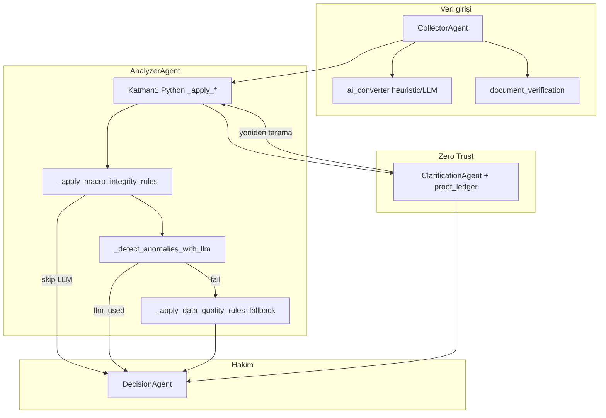

# Python vs LLM — Dedektiflik ve Hakimlik (Kod Tabanı İncelemesi)

> **Sürüm:** 2.0 — tam kod taraması (`analyzer_agent`, `penalty_codes`, `collector`, `decision`, `verification`, `ai_converter`, `document_classifier`, `clarification_agent`, `workflow`).  
> **Matrix:** `v3.2-macro` (`app/schemas/penalty_codes.py`, `decision_agent.MATRIX_VERSION`).

---

## 0. Terimler ve gerçek mimari

| Rol | Tanım | Kodda kim? |
|-----|--------|------------|
| **Dedektif** | İhlal/eksiklik tespiti, kanıt metni, `PenaltyCode` seçimi (veya eşdeğeri) | Analyzer kuralları, LLM `PenaltyDetection`, belge pipeline |
| **Hakim** | `compute_code_penalty` → `score_impact`; skor toplama; finansman kilidi | **Her zaman Python** (`add_penalty` içinde matris; `DecisionAgent`) |

**Önemli:** `add_penalty()` ve `add_missing_doc_penalty()` hem bulguyu yazar hem matristen puan keser. Yani “saf dedektif” ayrı bir katman **yok**; çoğu Python kuralı **dedektif + hakim birleşik** çalışır. LLM yolunda dedektiflik LLM’de, hakimlik `_validate_llm_result` → `add_penalty` ile Python’dadır — metaforunuza en yakın parça budur.

---

## 1. Analyzer çalışma sırası (gerçek sıra)

`analyzer_node` (`app/agents/analyzer_agent.py`) şu sırayı izler:

| Sıra | Fonksiyon | Koşul | Dedektif | Hakim |
|------|-----------|--------|----------|-------|
| 1 | `_apply_export_rules` | `refund_type == "ihracat"` | Python | Python (`add_missing_doc_penalty`) |
| 2 | `_apply_amount_mismatch_rules` | ihracat | Python | Python (`AMOUNT_MISMATCH_GCB`, `source=hybrid`) |
| 3 | `_apply_tevkifat_rules` | `refund_type == "tevkifat"` | Python | Python |
| 4 | `_apply_supplier_risk_rules` | her zaman | Python | Python |
| 5 | `_apply_ymm_rules` | her zaman | Python | Python |
| 6 | `_apply_deadline_rules` | her zaman | Python | Python |
| 7 | `_apply_period_rules` | her zaman | Python | Python |
| 8 | `_apply_macro_integrity_rules` | her zaman | Python | Python; `True` dönerse **LLM + fallback atlanır** |
| 9 | `_detect_anomalies_with_llm` | `macro_skip_llm == False` | LLM | Python (`_validate_llm_result`) |
| 10 | `_apply_data_quality_rules_fallback` | `not llm_used` ve makro yok | Python | Python (`source=fallback`) |

**`refund_type == "belirsiz"` veya `"indirimli_oran"`:** ihracat/tevkifat özel kuralları (GÇB, 2 No, tutar eşleşmesi) **çalışmaz**; tedarikçi, YMM, süre, dönem, makro, LLM/DQ devam eder.

**İade türü kaynağı:** `company_profile["refund_type"]` veya `classification_result` (`collector._detect_refund_type`). `q_refund_type_001` cevabı **yok sayılır** (C-01).

---

## 2. Ceza kanunnamesi — kod kodu envanter

Puanlar yalnızca `PENALTY_MATRIX` + `compute_code_penalty(code, count)` (`app/schemas/penalty_codes.py`).

### 2.1 Zorunlu belge (matris `source=python`, `PYTHON_ONLY`)

| Kod | Puan (birim / tavan) | Kilit | Şu an dedektif | Tetikleyici (kod) | Öneri: kim daha iyi? |
|-----|----------------------|-------|----------------|-------------------|----------------------|
| `GCB_MISSING` | 35 / 35 | Evet | **Python** | `_apply_export_rules`: envanterde doğrulanmış GÇB yok + **KDV%0 “güçlü” ihracat** faturası | **Python** — mevzuat deterministik, bypass riski |
| `NO2_DECLARATION_MISSING` | 35 / 35 | Evet | **Python** | `_apply_tevkifat_rules` | **Python** |
| `NO2_DECLARATION_UNPAID` | 15 / 15 | Hayır | **Python** | `_apply_tevkifat_rules` (`is_paid`) | **Python** |
| `YMM_REPORT_MISSING` | 35 / 35 | Evet | **Python** | `_apply_ymm_rules` (`estimated_refund_amount` ≥ 50.000) | **Python** |

**GÇB detayı (ihracat):**

- Envanterde `type=gumruk_beyannamesi`, `status=eksik`, `required=True` → doğrudan `GCB_MISSING`.
- Aksi halde: yalnızca `_invoice_zero_kdv_export` faturaları varsa ve `STRICT_INVENTORY_TRUST` altında doğrulanmış GÇB yoksa → `GCB_MISSING`.
- Sadece etiket ihracat, KDV sıfır değil → **`process_warnings`** (ceza kodu yok); `KDV_RATE_MISMATCH_EXPORT` matriste LLM’de.

### 2.2 Tedarikçi (matris `python`, `PYTHON_ONLY`)

| Kod | Puan | Kilit | Şu an dedektif | Tetikleyici | Öneri |
|-----|------|-------|----------------|-------------|--------|
| `SUPPLIER_BLACKLIST_LOCK` | 25 | Evet | **Python** | `risk_level=="kritik"` + `is_blacklisted` | **Python** — liste API’den gelmeli; LLM tahmin etmemeli |
| `SUPPLIER_SMIYB` | 25 | Hayır | **Python** | `risk_level=="kritik"` (kara liste değil) | **Python** (veri kaynağı şeffaf olmalı) |
| `SUPPLIER_HIGH_RISK` | 10 | Hayır | **Python** | `risk_level=="yüksek"` | **Python** |

**Veri kaynağı:** `normalized_suppliers` — mock senaryo JSON veya upload; Excel’den otomatik risk üretilmez. Dedektiflik aslında **veri sağlayıcı + Python eşiği**.

### 2.3 Zamanaşımı ve dönem (`python`, `PYTHON_ONLY`)

| Kod | Puan | Şu an dedektif | Tetikleyici | Öneri |
|-----|------|----------------|-------------|--------|
| `DEADLINE_CRITICAL` | 3 | **Python** | `_apply_deadline_rules`: kalan gün < 180 | **Python** |
| `DEADLINE_WARNING_IO` | 5 | **Python** | `indirimli_oran` + 180≤kalan<365 | **Python** |
| `PERIOD_OUT_OF_RANGE` | 10 | **Python** | `_apply_period_rules`: fatura tarihi `analysis_period` dışı (parse edilenler) | **Python** — LLM prompt’ta yasaklı |

**Not:** Bozuk tarih string’i `PERIOD_OUT_OF_RANGE` değil; `DQ_INVALID_DATE` (LLM/fallback) tarafına düşer.

### 2.4 Tevkifat (`python`, `PYTHON_ONLY`)

| Kod | Puan | Şu an dedektif | Tetikleyici | Öneri |
|-----|------|----------------|-------------|--------|
| `TEVKIFAT_MISSING_DECL` | 5 | **Python** | `is_tevkifat` ve `has_tevkifat_declaration==False` | **Python** |

### 2.5 Makro bütünlük

| Kod | Puan | Kilit | Matris | Şu an dedektif | Tetikleyici | Öneri |
|-----|------|-------|--------|----------------|-------------|--------|
| `DATA_INTEGRITY_FAILURE` | 40 | Evet | python | **Python** | Toplam fatura tutarı ≤ 0 | **Python** |
| `REFUND_LOGIC_IMPOSSIBLE` | 50 | Evet | hybrid | **Python** ve/veya **LLM** | Python: ≥%75 fatura tutarı ≤0; LLM: prompt’taki makro örnekler | **Python** sayısal eşik; **LLM** yalnızca ek pattern (çift tetik riski — aşağıda) |

Makro Python tetiklenince: `macro_skip_llm=True` → LLM ve DQ fallback **çalışmaz**.

### 2.6 Veri kalitesi (matris `source=llm`)

| Kod | Puan (birim / tavan) | Normal yol dedektif | Fallback dedektif | Tetikleyici (fallback) | Öneri |
|-----|----------------------|---------------------|-------------------|------------------------|--------|
| `DQ_INVALID_DATE` | 5 / 15 | **LLM** | **Python** | `date` var ama ISO parse edilemiyor | **Python** — tamamen kurala alınabilir |
| `DQ_ZERO_AMOUNT` | 5 / 10 | **LLM** | **Python** | `amount <= 0` | **Python** |
| `DQ_INVALID_VKN` | 3 / 9 | **LLM** | **Python** | `supplier_id` sayısal değil | **Python** |

**Çift ceza yok:** LLM başarılıysa fallback çalışmaz (`analyzer_node` satır 1171–1178).

**Env:** `LLM_ANOMALY_ENABLED=false` veya API yok → yalnızca fallback DQ.

### 2.7 Tutarsızlık / sahtecilik (matris `source=llm`)

| Kod | Puan | Şu an dedektif (normal) | Öneri |
|-----|------|-------------------------|--------|
| `DUPLICATE_INVOICE` | 10 | **LLM** | **Python** mümkün (`id` / fatura no gruplama) |
| `CHRONOLOGY_ERROR` | 8 | **LLM** | **Python** mümkün (sıralı tarih) veya **LLM** (karmaşık dosya hikâyesi) |
| `KDV_CALC_ERROR` | 15 | **LLM** | **Python** basit matrah×oran; **LLM** çok satır/istisna |
| `KDV_RATE_MISMATCH_EXPORT` | 10 | **LLM** | **Python** önerilir — ihracatta `kdv_rate>0` zaten uyarı var; ceza da Python olmalı |
| `SELF_INVOICE` | 25 | **LLM** | **Python** — alıcı/satıcı VKN eşitliği deterministik |
| `FUTURE_DATED_INVOICE` | 15 | **LLM** | **Python** — `date > bugün` |

### 2.8 Hibrit kodlar (matris `hybrid`, `LLM_ALLOWED_CODES` içinde)

| Kod | Matris | Şu an kim uygular dedektifliği | Öneri |
|-----|--------|--------------------------------|--------|
| `AMOUNT_MISMATCH_GCB` | hybrid | **Yalnızca Python** (`_apply_amount_mismatch_rules`) | **Python** — matris `source` hybrid yazsa da LLM prompt’ta kullanılabilir ama pratikte Python kesiyor; LLM’den kaldırılabilir |
| `REFUND_LOGIC_IMPOSSIBLE` | hybrid | **Python** (oran kuralı) + **LLM** (semantik makro) | **Python** ağır; LLM dar kapsam veya yalnızca `GENERAL_ANOMALY_*` |

### 2.9 Genel LLM anomali (matris `llm`)

| Kod | Puan | Dedektif | Öneri |
|-----|------|----------|--------|
| `GENERAL_ANOMALY_HIGH` | 20 | **LLM** | **LLM** — kanunname dışı gri alan; UI’da “zayıf kanıt” etiketi |
| `GENERAL_ANOMALY_MEDIUM` | 10 | **LLM** | Aynı |

LLM prompt: kanunname dışı pattern → bu kodlar + `macro_flag: true` (Shadow Learning için).

### 2.10 Rezerv (matriste yok / v3.3)

| Kod | Durum |
|-----|--------|
| `DQ_INVALID_VKN_CHECKSUM` | Yorumda rezerv; `cross_validate` checksum yalnızca **uyarı** (`VKN_CHECKSUM_WARN`), ceza yok |

---

## 3. LLM dedektif pipeline (ceza kodları)

**Dosya:** `analyzer_agent._detect_anomalies_with_llm`

| Adım | Ne yapar |
|------|----------|
| Kapı | `LLM_ANOMALY_ENABLED`, `GOOGLE_API_KEY` / `GEMINI_API_KEY`, `google-genai` paketi |
| Girdi | En fazla 30 fatura (`_sanitize_for_llm` — VKN maskeli), 15 tedarikçi, `refund_type` |
| Model | `GEMINI_MODEL` (varsayılan `gemini-2.5-flash`), structured JSON → `LLMAnalysisResult` |
| Filtre | `_validate_llm_result`: kod ∈ `LLM_ALLOWED_CODES`; count 1–100; merge |
| Hakim | `add_penalty(..., source="llm"|"hybrid")` |

**LLM’in bilerek raporlamaması gerekenler:** `PYTHON_ONLY_CODES` — prompt’ta listelenir (`_build_llm_system_prompt`).

**İade türüne göre odak:** `get_refund_focus_codes(refund_type)` — prompt’ta “önce bak” listesi (bilgi amaçlı).

**Özet metin:** `llm_result.summary` → UI “AI Denetçi Yorumu”; ceza değil.

---

## 4. Ceza dışı LLM kullanımları

Bunlar skor kanunnamesine doğrudan kod seçmez (veya seçmemeli).

| Bileşen | Dosya | Rol | Dedektif? | Hakim? |
|---------|-------|-----|-----------|--------|
| Tabular → canonical (yedek) | `ai_converter._llm_convert` | Heuristic başarısızsa ilk N satır map | Yapısal | Hayır |
| Tabular → canonical (birincil) | `ai_converter._heuristic_convert` | Sütun alias + satır parse | **Python** | Hayır |
| Belge sınıfı | `document_classifier.classify_document` | PDF/görsel tipi | **LLM** (veya dosya adı sezgisi) | Hayır |
| Belge alanları | `document_extraction` | `declaration_no`, `amount`, VKN… | **LLM** / mock / heuristic | Hayır |
| Clarification metni | `clarification_agent._generate_clarification_message` | Kullanıcıya empatik metin | Hayır (UX) | Hayır |
| Shadow Learning | `shadow_learning.log_risk_items_batch` | Log / öğrenme | — | Hayır |

---

## 5. Ceza dışı Python “dedektif” katmanları

| Bileşen | Dosya | Çıktı | Skor matrisi? |
|---------|-------|-------|----------------|
| İade türü | `collector._detect_refund_type` | `ihracat` / `tevkifat` / `belirsiz` | Hayır |
| Envanter güveni | `inventory_trust_policy` | `mevcut` sayılır mı | Dolaylı (GÇB tetiklenmesi) |
| Belge ingest | `document_verification.ingest_document_file` | `ProofRecord`, envanter | Hayır (gate) |
| Çapraz doğrulama | `cross_validate_document` | passed/failed, uyarılar | Hayır |
| GİB mock | `gib_api_mock` + `ENABLE_GIB_MOCK` | `GIB_MOCK_*` check | Hayır |
| Kanıt gate | `proof_ledger.validate_clarification_answers` | clarification devam eder mi | Hayır |
| İhracat zayıf etiket | `_apply_export_rules` | `process_warnings` | Hayır (sadece uyarı) |

**`STRICT_INVENTORY_TRUST=true`:** `user_assertion` / `llm_classifier` ile gelen `mevcut` GÇB **sayılmaz** → `GCB_MISSING` daha sık tetiklenir (Zero Trust).

---

## 6. Hakim katmanı (yalnızca Python)

| İş | Dosya | Açıklama |
|----|-------|----------|
| Puan kesimi | `compute_code_penalty` | `per_unit_penalty`, `max_penalty`, count sınırı |
| Risk kaydı | `add_penalty` / `add_missing_doc_penalty` | `RiskItem` / `MissingDoc` + `score_impact` |
| Clarification bonus | `decision._compute_clarification_bonus` | GÇB/2No “Evet” → +6 (kanıt `passed` ise pending sayılmaz) |
| Skor | `decision_node` | `100 - risk - belge + bonus` |
| Risk bandı | `_determine_risk_category` | ≥90 / ≥60 / altı |
| Finansman | `_check_finance_eligibility` | Düşük risk + tutar ≥50k + `MANDATORY_LOCK_CODES` yok |
| Kilit mesajı | `finance_headline` | Skor yüksek + kilit → “Ön Onay: RED …” |

**`refund_type` clarification bonusu kaldırıldı** (`CLARIFICATION_SCORE_ADJUSTMENTS` içinde artık yok).

---

## 7. Ortam değişkenleri (dedektif/hakim davranışı)

| Değişken | Etki |
|----------|------|
| `LLM_ANOMALY_ENABLED` | `false` → LLM dedektif kapalı, DQ fallback |
| `GOOGLE_API_KEY` / `GEMINI_API_KEY` | LLM anomali + belge + clarification mesajı |
| `GEMINI_MODEL` | Anomali modeli |
| `MOCK_DOCUMENT_EXTRACTION` | Belge çıkarma mock |
| `DOCUMENT_CLASSIFIER_ENABLED` | `false` → dosya adı sezgisi |
| `STRICT_PROOF` / `REQUIRE_VERIFIED_PROOF` | Kanıt zorunluluğu |
| `STRICT_INVENTORY_TRUST` | Doğrulanmamış envanter → GÇB sayılmaz |
| `ENABLE_GIB_MOCK` | GÇB çapraz doğrulama mock |
| `ALLOW_MOCK_FALLBACK` | Upload fail → mock senaryo (Collector) |
| `MAX_LLM_TABULAR_ROWS` | Tabular LLM örnek satır sayısı |

---

## 8. Metaforunuzla uyum tablosu

| Beklenti | Gerçek |
|----------|--------|
| LLM dedektif, ceza vermez | **Kısmen:** LLM kod seçer; puanı Python keser ✓ |
| Python daima hakim | **Evet** (skor + kilit) ✓ |
| Python asla dedektif olmasın | **Hayır** — Katman 1 + DQ fallback + makro + belge kuralları Python dedektif |
| Her konuda LLM dedektif | **Hayır** — zorunlu belge, süre, dönem, tedarikçi, makro (Python kolu) LLM dışı |

---

## 9. Önerilen hedef mimari (ürün kararı — kod değil)

“Python yalnızca hakim” hedefine yaklaşmak için:

1. Tüm `_apply_*` ve fallback → yalnızca `Finding` listesi üretsin.
2. Tek `sentence_findings(findings) -> risk_items` Python hakim motoru `add_penalty` çağırsın.
3. DQ kodlarını matriste `source=python` yapın; fallback’i birincil yol veya LLM’yi kapatın.
4. `AMOUNT_MISMATCH_GCB`, `KDV_RATE_MISMATCH_EXPORT`, `SELF_INVOICE`, `DUPLICATE_*` için Python dedektif ekleyin; LLM’yi `GENERAL_ANOMALY_*` + isteğe bağlı makro semantiğe indirin.
5. `REFUND_LOGIC_IMPOSSIBLE` için Python ve LLM çakışmasını tekilleştirin (aynı dosyada iki dedektif aynı kodu üretmesin).

---

## 10. Hızlı özet sayımı

| Kategori | Adet (yaklaşık) |
|----------|------------------|
| `PenaltyCode` toplam | 26 (checksum rezerv hariç) |
| Matris `source=python` | 15 |
| Matris `source=llm` | 9 |
| Matris `source=hybrid` | 2 |
| Analyzer’da yalnızca Python dedektif + hakim | ~15 kod yolu + uyarılar |
| LLM dedektif (normal) + Python hakim | `LLM_ALLOWED_CODES` kümesi |
| LLM dedektif yok, Python fallback | DQ ×3 + LLM kapalı senaryo |

---

## 11. İlgili dokümanlar

- `docs/IADEAJAN_ALGORITMA_v3.2.md` — skor formülü ve kanunname
- `docs/UYGULAMA_CALISMA_MANTIGI_ve_GUVENLIK.md` — Zero Trust akışı
- `docs/GUVENLIK_VE_DOGRULAMA_BOSLUKLARI.md` — bilinen boşluklar

**Bakım:** `penalty_codes.py` veya `analyzer_agent._apply_*` değişince bu tablonun §2 ve §3 bölümleri güncellenmelidir.
